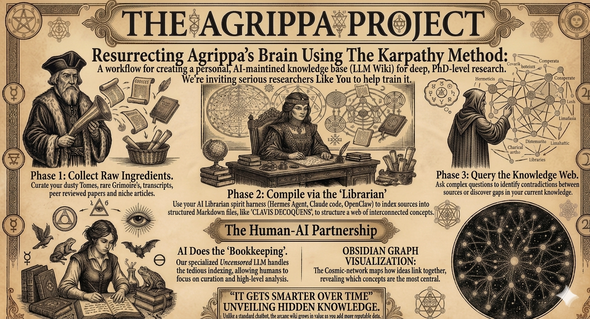

## The Agrippa Project ~ Help Resurrect Agrippa Brain! 

# The Agrippa Project — Community Research Wiki
*Built with the [LLM Wiki Method by Andrej Karpathy](https://gist.github.com/karpathy/442a6bf555914893e9891c11519de94f)*

**A living, self-improving knowledge base on Heinrich Cornelius Agrippa. We're inviting serious researchers to help train it.**

---

## Serious research. Peer-reviewed. Grounded in fact. No slop.

> Dr. Justin Sledge of [ESOTERICA](https://www.youtube.com/watch?v=v0VZvMmelN4) said it plainly: generative AI represents a "vampirism of the market" driven by "seemingly demonic intelligences" housed in "dark satanic data centers" — a "semiotics of mockery" where our collective humanity becomes the "punchline of a vicious joke told just before opening bell."

Ask any LLM about esoteric literature and you'll get confident-sounding garbage — misattributed quotes, blended sources, fabricated citations. The Western esoteric tradition is already drowning in misinformation. Careless AI has been accelerating it.

**The Agrippa Project exists to take that problem head-on.**

---

## What The Hell is this?

An AI-powered research wiki built from curated primary sources, grimoires, and academic scholarship on Agrippa's *De Occulta Philosophia*, his Neoplatonism, Hermeticism, and Renaissance magic. The Karpathy LLM Wiki method anchors every response to a vetted corpus of critical editions and peer-reviewed scholarship. The system draws only from what has been verified and ingested. No freeform generation. No confabulation.

*The answer to AI slop isn't abandoning the tools — it's building accountability into the architecture. That's what this is.*

Query it like a researcher. Get graduate-level, sourced responses. Download the **Obsidian vault release** and carry the full knowledge graph offline — versioned, cited, yours.

---

## Peer review via GitHub — a real vetting track

This is not a wiki where anyone can post anything. All contributions enter a **GitHub-based peer review pipeline**:

- Submissions opened as **pull requests**, reviewed by contributors with relevant expertise
- Merged contributions are tagged, credited, and ingested into the next vault release
- Rejected or contested submissions remain in PR history — nothing disappears, everything is traceable
- Queries that expose gaps in the corpus are flagged as **open issues** — the community works them, the wiki gets tighter

**Every input is accountable. That's how you earn output you can trust.**

---

## The feedback loop

**Vetted sources in → grounded responses out → queries expose gaps → peer-reviewed contributions fill them → next vault release is tighter.**

Every good question sharpens the system. Every submitted paper, translation note, or cross-reference makes the next release denser. The system self-improves — but only on verified, reviewed material.

---

## How to participate

- 🔍 **Query the wiki** — hard questions get sourced, graduate-level answers
- 📦 **Download the Obsidian vault** — offline, versioned, graph-browsable, freely yours
- 📄 **[Submit a source](https://github.com/bibliothecamagicarum/Agrippa/issues)** — PDFs, papers, translations, videos; academic and primary sources prioritized
- 💬 **[Post a query](https://github.com/bibliothecamagicarum/Agrippa/issues)** — edge cases sharpen the system most

---

## Who this is for

Occultists who read critically. Academics who want fast synthesis with citations. Obsidian users who want a serious Western esotericism knowledge graph. Anyone who agrees with Sledge that the current trajectory is a mockery of real scholarship — and wants to build something better.

**You don't need a PhD. You need good questions.**

---

*Community-run. Vault releases freely distributed. All contributors credited. PR history permanent and public.*

> *Omnia possibilia sunt credenti.* — H.C. Agrippa
---
### Ingested Corpus ~ Sources Updated: 4/30/2026
 **Heinrich Cornelius Agrippa: Source Bibliography and Analysis**

*   **Agrippa von Nettesheim, Heinrich Cornelius. *Three Books of Occult Philosophy*. Translated by Eric Purdue, Inner Traditions, 2021.**
    *   **Argument:** This seminal work systematically organizes the natural, celestial, and divine worlds into a **cohesive program of study** for the practitioner of magic, aiming to restore reason to the ancient disciplines.
    *   **Top Quote:** "**There is a threefold world—that is, the elemental, celestial, and intellectual.** Each inferior is ruled by its superior, accepting virtues flowing from the Archetype and highest Maker...".
    *   **Contribution:** Serves as the **primary source material** for Agrippa’s occult system, providing the most accurate modern English translation of the 1533 Cologne edition.

*   **Copenhaver, Brian P. *Magic in Western Culture: From Antiquity to the Enlightenment*. Cambridge University Press, 2015.**
    *   **Argument:** Copenhaver views Agrippa’s work as a **vulgarization and handy compendium** of the great Neoplatonic revival begun by Ficino and Pico, digesting centuries of magical data into a philosophical framework.
    *   **Top Quote:** "**Agrippa copied, digested and reorganized** the historical, theoretical, and empirical arguments for magic made by Ficino and others, presenting them in handy form".
    *   **Contribution:** Provides a critical historical context for Agrippa's work, detailing its role as a bridge between **Renaissance occultism and the scientific revolution**.

*   **Lehrich, Christopher I. *The Language of Demons and Angels: Cornelius Agrippa’s Occult Philosophy*. Brill, 2003.**
    *   **Argument:** Lehrich argues that the *Three Books* constitute a **sophisticated linguistic and semiotic project** that seeks to reach the undifferentiated absolute Word of God through magical techniques of interpretation and active writing.
    *   **Top Quote:** "**DOP’s magus uses ancient holy magical techniques** to make manifest the immanent presence of the Divine in the world".
    *   **Contribution:** Offers a modern theoretical analysis of the text, emphasizing the **centrality of language, signs, and sigils** in Agrippa’s magical theory.

*   **Compagni, Vittoria Perrone. "Dispersa Intentio: Alchemy, Magic and Scepticism in Agrippa." *Early Science and Medicine*, vol. 5, no. 2, 2000, pp. 160-177.**
    *   **Argument:** Compagni challenges the perceived break between Agrippa's magic and his skepticism, asserting that his **continued alchemical practice and theoretical updates** in 1533 demonstrate a unified program of cultural and religious reform.
    *   **Top Quote:** "The analysis of the alchemic passages in *De occulta philosophia* proves that **Agrippa's transmutatory operations have no secondary role** in his 'restored' magic".
    *   **Contribution:** Highlights the **alchemical dimensions of the final draft** and assemble the "dispersed intention" of the text.

*   **Hanegraaff, Wouter J. "Better than Magic: Cornelius Agrippa and Lazzarellian Hermetism." *Magic, Ritual, and Witchcraft*, vol. 4, no. 1, 2009, pp. 1-25.**
    *   **Argument:** Agrippa’s mature perspective is deeply influenced by the **Lazzarellian Hermetic doctrine of deification**, where true knowledge (gnosis) leads to a spiritual rebirth that grants powers "better than magic".
    *   **Top Quote:** "Agrippa’s true and pure divine *magia*... had **nothing to do with astral magic** or any other procedures... that were under man’s control".
    *   **Contribution:** Identifies the **Christian Hermetic roots of Agrippa’s "supreme arcanum"** regarding the effects of spiritual rebirth.

*   **Hanegraaff, Wouter J. *Esotericism and the Academy: Rejected Knowledge in Western Culture*. Cambridge University Press, 2012.**
    *   **Argument:** This work examines how magic and esotericism were constructed as "rejected knowledge," using Agrippa as the **paradigmatic example of the *occulta philosophia*** discourse that once challenged biblical religion and Greek rationality.
    *   **Top Quote:** "Magic was explicitly presented here as the '**ancient wisdom**,' whose reputation needed to be purified from the common association with illicit practices".
    *   **Contribution:** Situates Agrippa within the **historiography of "rejected knowledge"** and explores the academic recovery of the Hermetic tradition.

*   **Sledge, Justin. "Agrippa Lecture 1-14." *Esoterica*, 2025.**
    *   **Argument:** Sledge presents Agrippa as the **pivotal hinge of Western occultism**, synthesizing diverse streams like Kabbalah, Hermeticism, and medieval grimoire magic into a system that remains the foundation for modern practice.
    *   **Top Quote:** "**Western occultism really hinges on the person of Agrippa**... it's inconceivable to think about magic now without thinking about it as it has passed through the lens of Agrippa".
    *   **Contribution:** Provides a **comprehensive overview of Agrippa's life and influences**, addressing the "magical dilemma" between magical powers and mystical illumination.

*   **Yates, Frances A. *The Occult Philosophy in the Elizabethan Age*. London: Routledge & Kegan Paul, 1979.**
    *   **Argument:** Yates argues that the "occult philosophy" synthesized by Agrippa was the **dominant intellectual force of the Elizabethan era**, profoundly influencing John Dee, Edmund Spenser, and William Shakespeare.
    *   **Top Quote:** "Agrippa’s *De occulta philosophia* is now seen as the **indispensable handbook of Renaissance ‘Magia’ and ‘Cabala’**...".
    *   **Contribution:** Connects Agrippa's system to **English Renaissance literature and the "inspired melancholy"** associated with Albrecht Dürer.

*   **Yates, Frances A. *Giordano Bruno and the Hermetic Tradition*. University of Chicago Press, 1964.**
    *   **Argument:** This foundational study argues that Renaissance magic was centered on a "Hermetic-Cabalist" tradition, with Agrippa providing the **first clear survey that fully opened "the door into the forbidden"**.
    *   **Top Quote:** "Agrippa was thus not only using the *Asclepius* and its magic, but **other treatises of the *Corpus Hermeticum*** the philosophy of which he incorporated into his magical philosophy".
    *   **Contribution:** Established the **seminal framework for modern scholarship on the Hermetic tradition**, placing Agrippa at the core of the magical revival.

---

> *Omnia possibilia sunt credenti.* — H.C. Agrippa
